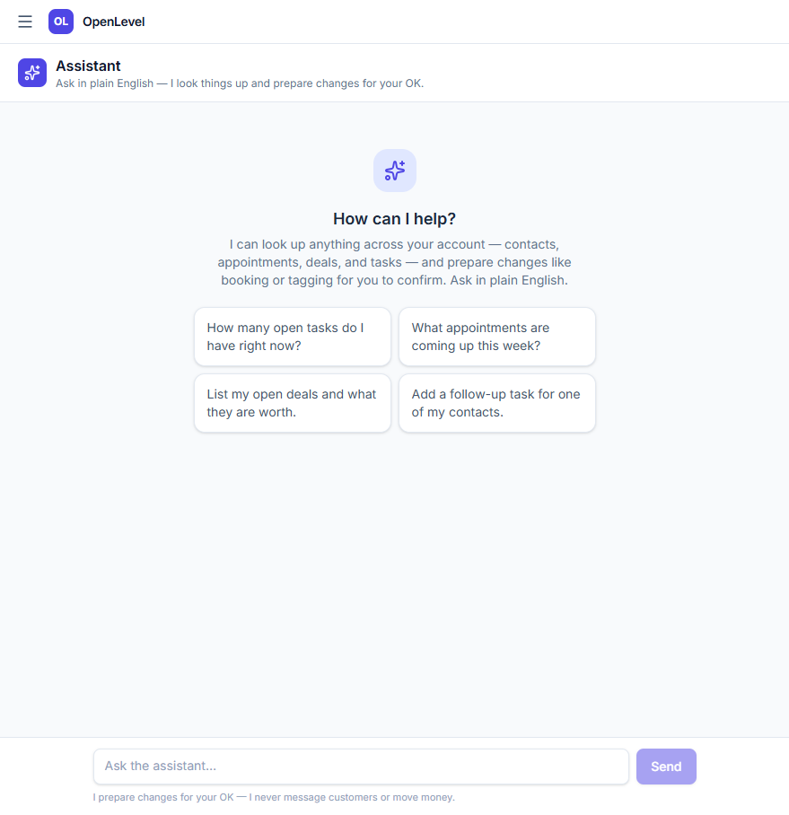
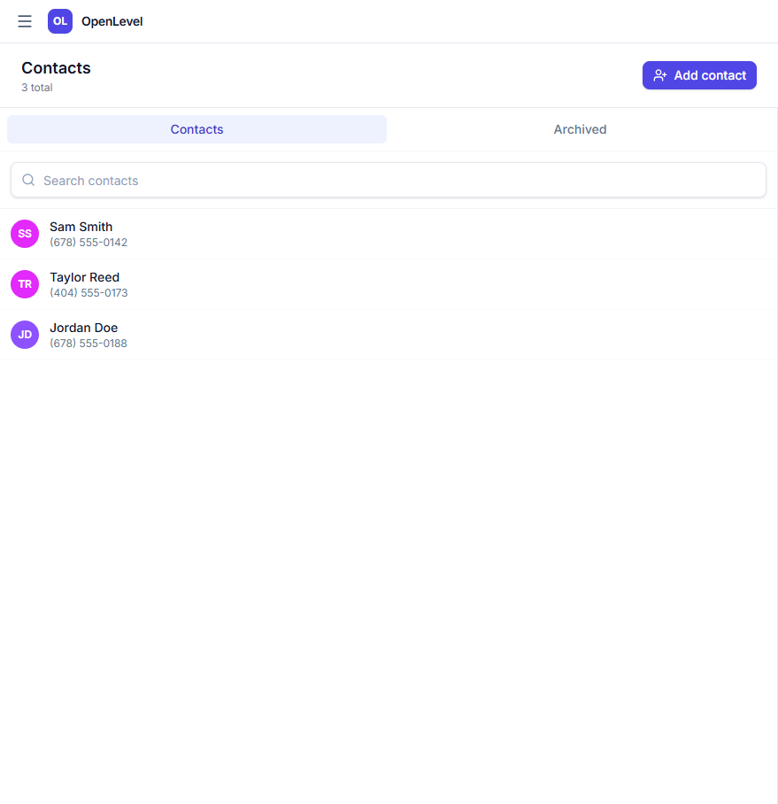
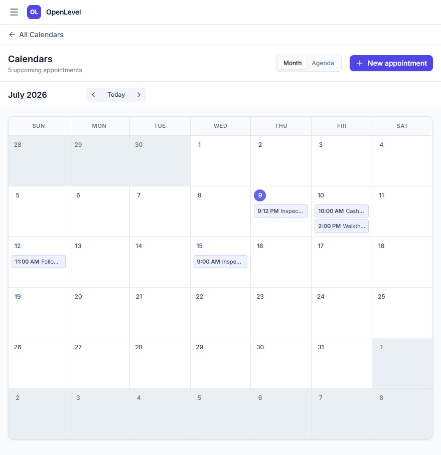
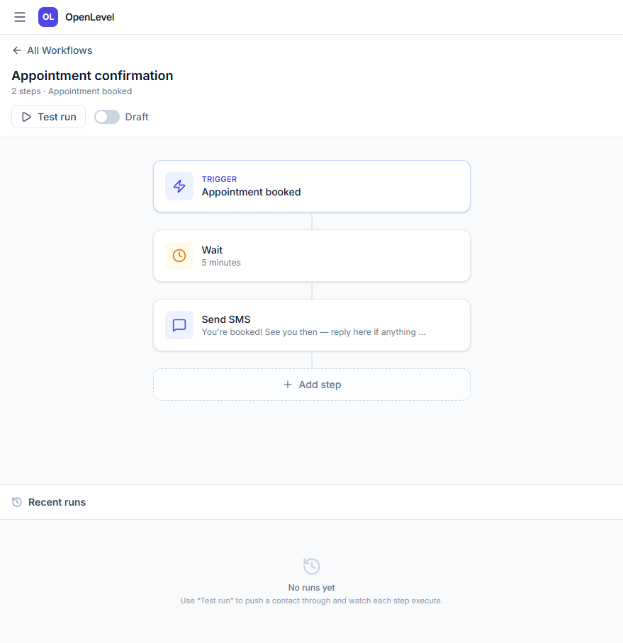

# OpenLevel

**The Open-Source, AI-First Alternative to GoHighLevel**

OpenLevel is a lightweight, modern web app and CRM designed specifically to be driven by AI agents. Instead of fighting with legacy interfaces and massive SaaS subscriptions, OpenLevel gives you the core CRM engine (contacts, pipelines, locations, custom fields) on a modern stack that is actually a joy to use and infinitely customizable.

## Demo

https://github.com/jahfeelautomation/openlevel/raw/master/docs/assets/demo_video.mp4


## Screenshots

### Dashboard


### Contacts & CRM


### Calendars (Month View)


### Automations


## Why OpenLevel?
If you've ever wanted to build your own "Done-For-You" Ops agency without paying massive white-labeling fees to proprietary software companies, OpenLevel is your starting point. It provides the core plumbing you need to run high-ticket bespoke automation services for your clients.

We use a "One API, Two Clients" pattern:
- `server/` - The backend API (Hono, SQLite/Postgres, Drizzle ORM).
- `src/` - The web application SPA (Vite, React, Tailwind).
- `openconnector/` - The mobile application (Expo, React Native, NativeWind).

* **Multi-Tenant:** Built for agencies. Manage multiple locations/clients easily.
* **Modern Stack:** Built on React, Tailwind, and Hono.
* **AI-First:** Native routing for AI Agents (Anthropic, OpenAI) to take actions on behalf of your clients.

### Running the Mobile App (OpenConnector)

1.  Navigate to the app directory:
    ```bash
    cd openconnector
    ```

## Getting Started

1. Clone the repository
2. Run `npm install`
3. Run `npm run dev` to start the local development server.

## License
MIT
